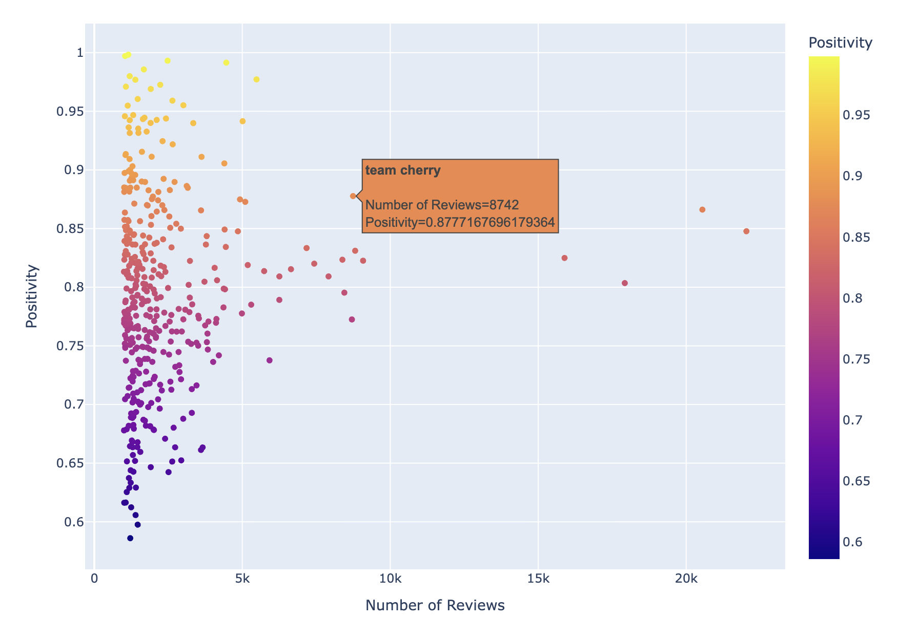
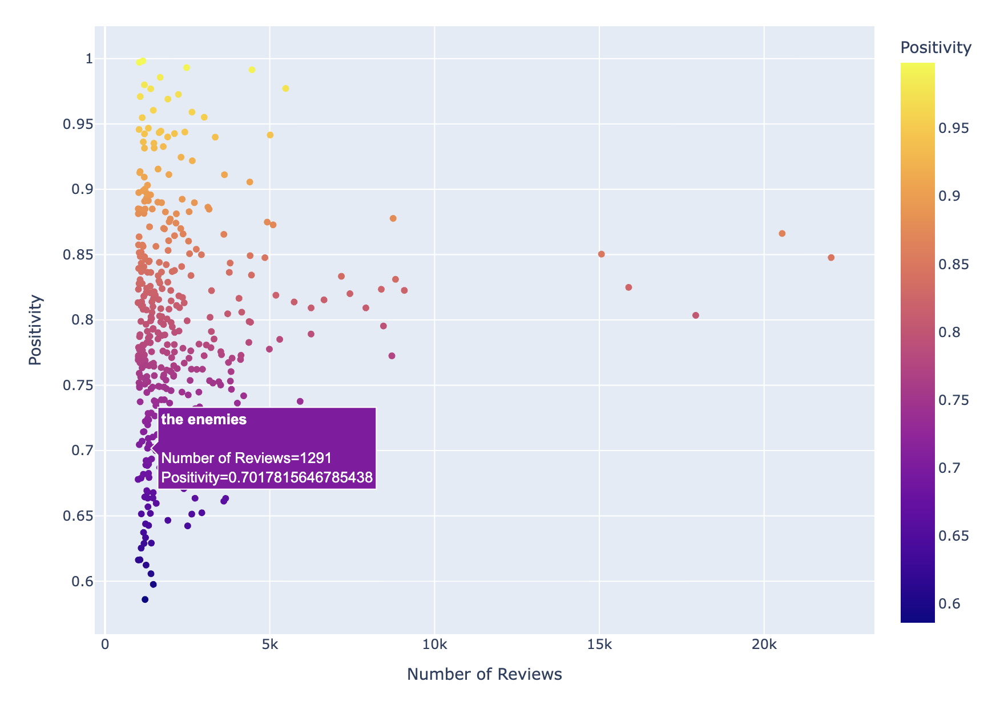
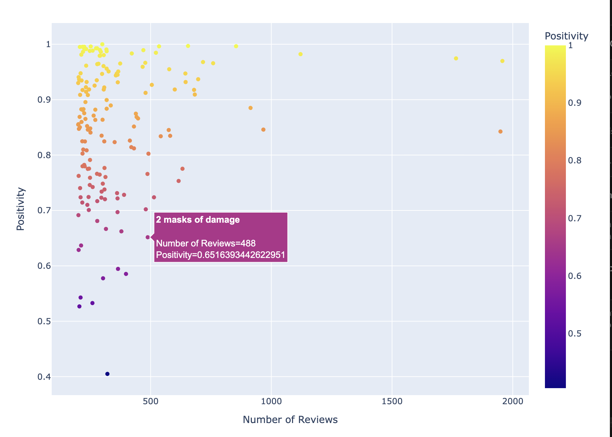
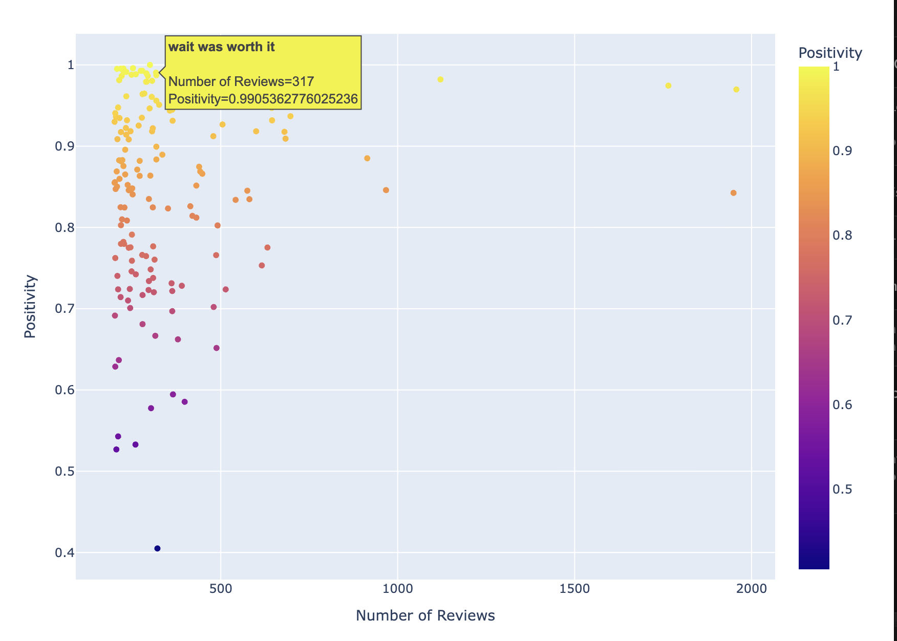

  

<h1 align="center">Silksong Data Analysis</h1>

  Large-scale analysis of Steam review data for Hollow Knight: Silksong

  
  
  

---

## About Project

This project scrapes Steam review data from Team Cherry's Hollow Knight: Silksong. The game has currently over 100,000 Steam reviews, and by analyzing this data I hope to find some interesting patterns. 

---

## How to Scrape Data

All the data used in our code is currently inside the 'skong' json file, which is ommitted here due to size. The file, however, can be obtained  
by running the code in 'data_scrape.py.' To run it, just run it as a normal Python script, and the file will be created at your current directory. 

Other important data, like the word frequency in reviews, is obtained by running the code in 'review_analysis.py.' 

---

## Review Distribution

  

This shows how the Steam reviews were distributed. Unsurprisingly, the number of reviews peaked in the first week of the game's release, reaching its highest count during the release day (which accounts for roughly 13% of all reviews).

---

### Reviews vs Playtime

Next, we look at how these reviews were distributed based on the player playtime (in hours) at the time the review was made. In Steam, there isn't a numerical scoring -- you just indicate whether the game is positive or negative, aka a binary system for rating games. One might suspect that lower playtimes might mean a higher ratio of negative to positive reviews, since players who play the game for a long time are more likely to rate it positively. However, take a look at this graph

  

This playtime-based review data shows that Hollow Knight: Silksong is not merely well-liked but exceptionally well-designed across all stages of play. Contrary to the common assumption that low playtime correlates with dissatisfaction, even players with under 10 hours overwhelmingly recommend the game, indicating a strong first impression and effective early-game design. As playtime increases, the already high positivity rate becomes even stronger, demonstrating that long-term engagement reinforces rather than erodes player satisfaction. The persistence of extremely positive reviews among players with hundreds of hours further suggests deep replayability and lasting appeal. Taken together, this pattern is the statistical signature of a landmark title—one that succeeds immediately and continues to reward players over time, rather than relying on novelty or filtering out dissatisfied users. In other words, the game makes a very strong first impression; it starts excellent and stays excellent.

---

## Text Analysis in Reviews

Take a look at the following two graphs

  

  

These graphs attempt to measure not just whether Hollow Knight: Silksong is liked, but how sentiment is embedded in the language of its reviews. Instead of treating reviews as a single up-or-down vote, this analysis breaks every review into consecutive two-word phrases (bigrams) and then asks a more subtle question: when players use a particular phrase, how often are they recommending the game? Plotting each phrase by its total frequency and its positivity ratio allows us to see which parts of the shared vocabulary of the community are associated with praise and which cluster around dissatisfaction. In effect, the graph maps the emotional meaning of the game’s discourse.

The first graph shows the game's developers, "Team Cherry," which are regarded in a very positive light. It appears in nearly 9,000 reviews—an enormous sample—yet still carries close to 88% positivity. That means even when players directly discuss the developers, a topic that often becomes contentious in gaming communities, sentiment remains strongly favorable. This suggests that trust in the studio is not fragile or fanboy-driven but broadly shared across the player base. The developers themselves are part of the game’s positive identity, not a lightning rod for controversy (something which I'm sure they'd be thrilled to know). The second graph is also very revealing, since it suggests the enemies might be a big dissatisfaction  
point. The positivity rate is still high as a raw score, but it's noticeably lower in the graph. It also adds up with some of the other words that you can find down at these low points: "two masks," "double damage," "too hard," "long runback." What all of these have in common is that they're all criticisms of the game's combat system and its difficulty: many enemies deal double damage to the player, and the runback (following player death) to some of these enemies can be long and frustating. To someone who has played the game, this isn't surprising, but it does show a key idea across all negative reviews.

---

### Extended Phrase Analysis

We can extend this analysis to longer continuous words, getting graphs like this

  

  

This makes it easier to decypher some of the positive and negative aspects of the game the reviews describe.

---

## Generating Custom Analyses

You can get graphs like this yourself by creating a JSON file with the data by using the 'get_num_word_json()' function inside 'review_analysis.py.' The parameters of the function are the following

- num: number of consecutive words you want to look at across all reviews  
- threshold: minimum number of reviews that you want these words to show up in  
- name: name of JSON file you want to create  

After creating the JSON file, you can create a bigram by running the 'word_analysis()' function in 'graphs.py,' with the parameter being the name of the JSON file you just created.
