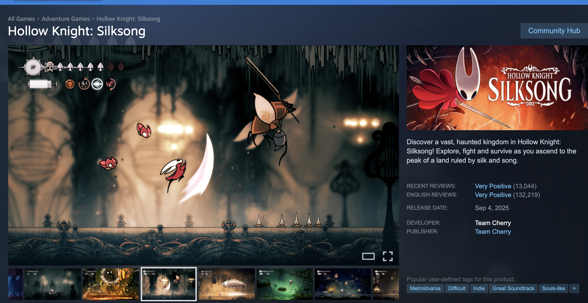
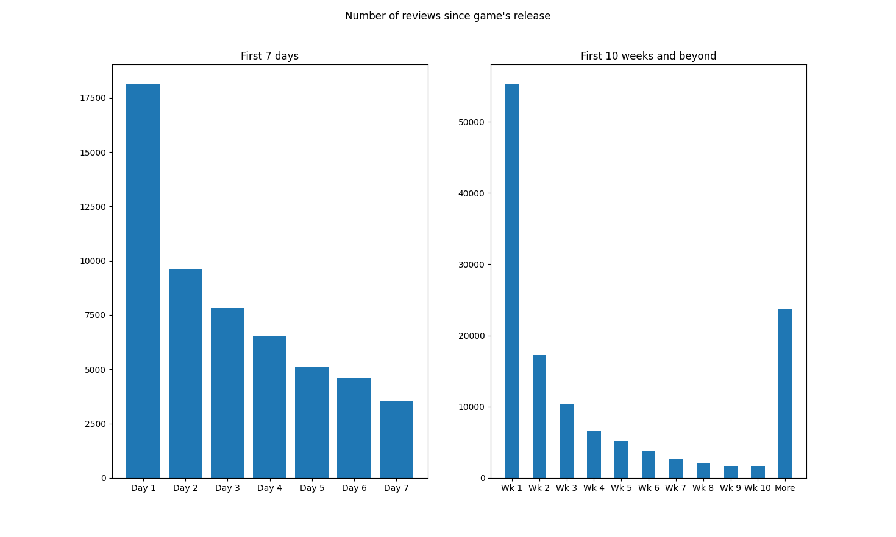

# Silksong Data Analysis

## About Project
This project scrapes Steam review data from Team Cherry's Hollow Knight: Silksong. The game has currently over 100,000 Steam reviews, and by analyzing this data I hope to find some interesting patterns. 

## How to Scrape Data
All the data used in our code is currently inside the 'skong' json file, which is ommitted here due to size. The file, however, can be obtained
by running the code in 'data_scrape.py.' To run it, just run it as a normal Python script, and the file will be created at your current directory. 

Other important data, like the word frequency in reviews, is obtained by running the code in 'review_analysis.py.' 

## Findings

This shows how the Steam reviews were distributed. Unsurprisingly, the number of reviews peaked in the first week of the game's release, reaching its highest count during the release day (which accounts for roughly 13% of all reviews).
